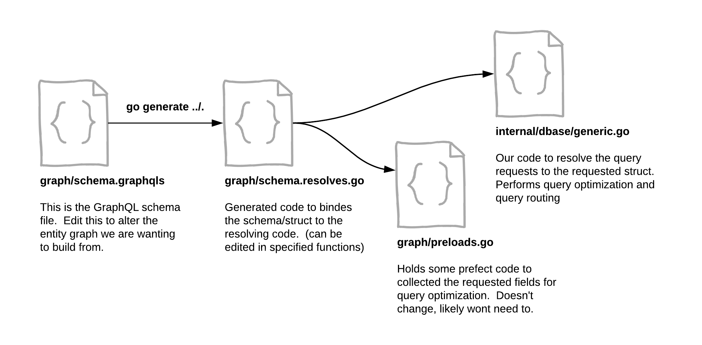

# Mercantile:  An EarthCube Graph Server

## Status

This is very early work!  Some issues include:

* The options heavy SPARQL is SLOOOOW   need to code in logic to limit the options
* The query offset is not wired in...  just need to do that.
* The query pattern is not resolved...  need to work up how to map interfaces query
needs to te GraphQL pattern.
* The docker image uses Google Cloud Run Distro..  but not sure how will it will deploy there yet,
need to test that.
* The wild card and multi word searching works but I need to improve the pattern and error handling
and document the approach that maps the GraphQL query structure to SPARQL.
* Need to establish other search patterns than full text index.  For example, exact key
searches for DOIs or IGSNs.  

## About

This is a GraphQL server that connects into a defined RDF triple store.  
It fronts a set of SPARQL calls to a data interface defined from the
schema.org type Dataset "class" (ref: https://schema.org/Dataset).

This is a simple code gen build based on the 99 Designs gqlgen package
(ref: https://github.com/99designs/gqlgen).  This leverages the
schema.org types as interface guidance.  My desire is to use SHACL shape
graphs for this.  This has been done by TopQuadrant but is obviously
closed source.  Shape to interface should be easy if I get time.  

## Running

Just the basics:

```bash
go run server.go
```

Then visit GraphQL playground instance at: http://localhost:8080/

Try a GraphQL query like:

```graphql
query {
  dos(q:"alken*")
  {
    name
    subject
    type
    addtype
    score
    relto
    url
    description
  }
}

```

The search is case insensitive but needs the wild card character for prefix match patterns.


## Generating



I'll work this up some more.  The basic process is that changes to the schema.graphqls 
file can be propagated through the code via ```go generate ./...``` .  

The preloads.go file lets us pass through the requested fields for use in 
query optimization.   The resolver.go code then binds into our code in the 
internal/dbase directory to make the SPARQL calls and resolve the request.  

## Mercantile

I'm not fully convinced that GraphQL is the best way and it's obviously
not the only way.  Other options
being JSON:API for example.  Also this obviously doesn't address other
access methods like KoopJS or S3 Query patterns.  Mercantile seems a
sufficiently generic name to scope this work under.
